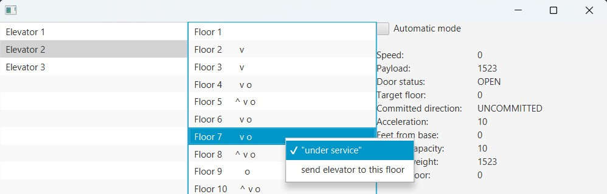
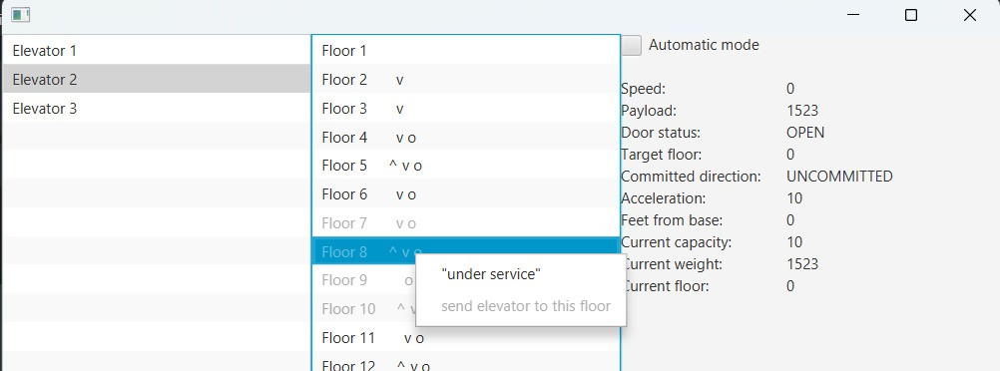

# Graphical User Interface with JavaFx

### Prerequisites

- [x] JDK 11 (or higher)
- [x] The elevator simulator https://github.com/winterer/elevator/releases/tag/v0.1.2 is required to simulate use of a real elevator service.
- [x] Download the jar file from the latest release

### Running the program

1. Run the elevator simulator and configure the number of floors and elevators
2. Start the jar file with the following command:

`java -jar *insert name*.jar localhost:1099 -bn ElevatorSim`\
or\
`java -jar *insert name*.jar <ip>:<port> -bn <bind_namel>`

### Description of the GUI

The GUI is divided into three columns. The left column is a list of the available elevators. 
The user can select a specific elevator to view its current state and handle its requests.
The middle column shows a lift of all floors in the building and additionally shows the
pressed buttons on the floor with either "^" or "v", meaning a person on this floor requested 
an elevator to go either up or down. If a floor is showing "o" this means, a person currently 
inside the selected elevator requested to go to this floor. 

By right clicking on a floor, the user can either request to send the selected elevator to targeted floor
or select its serviceable state, indicating if the floor can be reached by the elevator or not.

The third column shows various information about the selected elevator such as its current speed,
door status, target floor and more. 

### Presentation

The presentation can be found [here](https://docs.google.com/presentation/d/12DmrDZKuvW4P3jDPFCXgEq6uBdXtNlmkdX4tzJ1njTM/edit?usp=sharing).